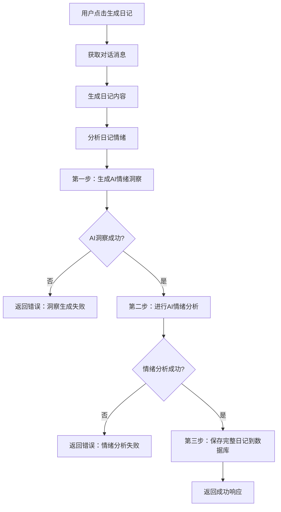
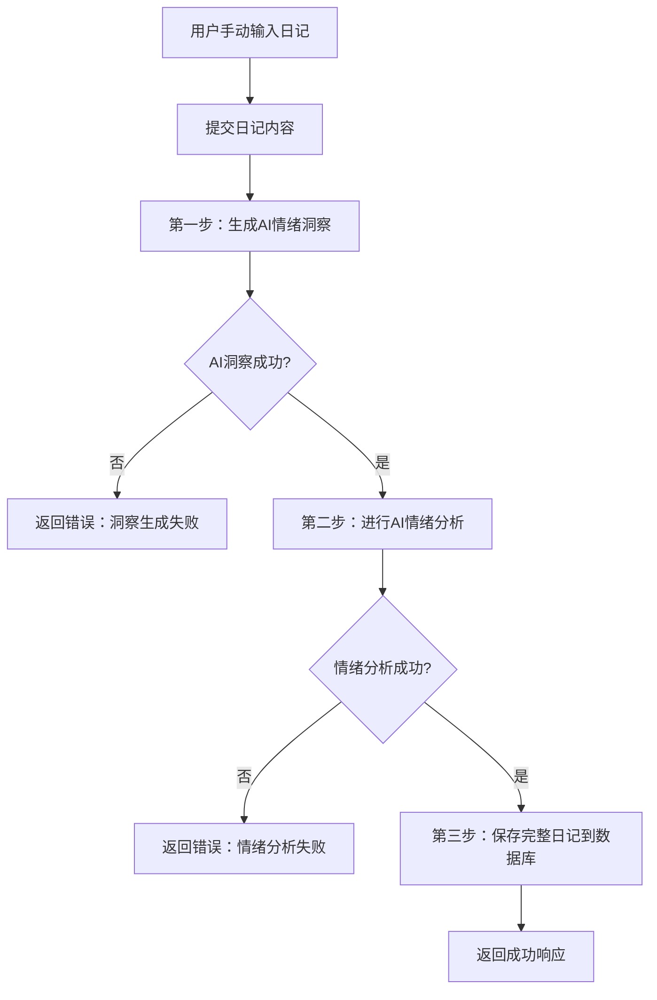

# AI日记生成流程说明

## 概述
现在每篇日记的生成都需要经过两个AI调用步骤，只有两个都成功完成，日记才算真正生成成功。

## 工作流程

### 1. AI对话日记生成 (`/api/diary/generate`)



**详细步骤：**

1. **获取对话消息**：从数据库获取用户与AI的对话记录
2. **生成日记内容**：调用AI生成日记正文
3. **分析日记情绪**：确定日记的情绪标签
4. **第一步：AI情绪洞察**：调用 `generateAIInsight()` 生成个性化洞察
5. **第二步：AI情绪分析**：调用 `analyzeWithDeepSeek()` 进行结构化分析
6. **第三步：保存日记**：只有前两步都成功，才保存日记到数据库

### 2. 手动日记创建 (`/api/diary/create`)



## 关键特性

### ✅ **同步执行**
- 两个AI调用必须**都成功**，日记才算生成完成
- 任何一个失败，整个流程就会终止，返回错误
- 不会出现"部分完成"的状态

### ✅ **数据完整性**
- 日记保存时包含所有AI分析结果
- `ai_insight`：个性化情绪洞察
- `mood_score`：心情指数（1-10）
- `emotion_keywords`：情绪关键词数组
- `event_keywords`：事件关键词数组

### ✅ **错误处理**
- AI洞察失败 → 返回"AI情绪洞察生成失败"
- AI分析失败 → 返回"AI情绪分析失败"
- 数据库保存失败 → 返回"保存日记失败"

### ✅ **用户体验**
- 用户看到的是"完整的日记"或"明确的错误信息"
- 不会出现内容不完整的日记
- 加载状态更准确（等待两个AI调用完成）

## 技术实现

### 代码结构
```typescript
// 第一步：AI情绪洞察
aiInsight = await generateAIInsight({...})
if (失败) return 错误

// 第二步：AI情绪分析  
analysisResult = await analyzeWithDeepSeek({...})
if (失败) return 错误

// 第三步：保存完整数据
diaryEntry = await supabase.insert({
  ai_insight: aiInsight,
  mood_score: analysisResult.mood_score,
  emotion_keywords: analysisResult.emotion_keywords,
  event_keywords: analysisResult.event_keywords,
  // ... 其他字段
})
```

### 错误处理
```typescript
try {
  // AI调用
} catch (error) {
  return NextResponse.json({ 
    error: "具体错误信息" 
  }, { status: 500 })
}
```

## 测试方法

### 1. 测试页面
访问 `/test-ai-insight` 页面测试手动日记创建

### 2. 聊天页面
在聊天页面点击"生成今日心语日记"测试对话日记生成

### 3. 验证结果
- 检查日记是否包含完整的AI洞察
- 检查是否包含情绪分析数据
- 验证错误情况下的响应

## 注意事项

1. **API调用时间**：两个AI调用会增加日记生成时间
2. **错误重试**：用户需要手动重试失败的请求
3. **备用方案**：目前没有备用模板，确保AI服务稳定
4. **监控日志**：通过控制台日志监控每个步骤的执行状态

## 未来优化

1. **并行执行**：两个AI调用可以并行执行减少总时间
2. **重试机制**：自动重试失败的AI调用
3. **备用模板**：AI失败时提供基础模板
4. **进度指示**：前端显示每个步骤的进度
