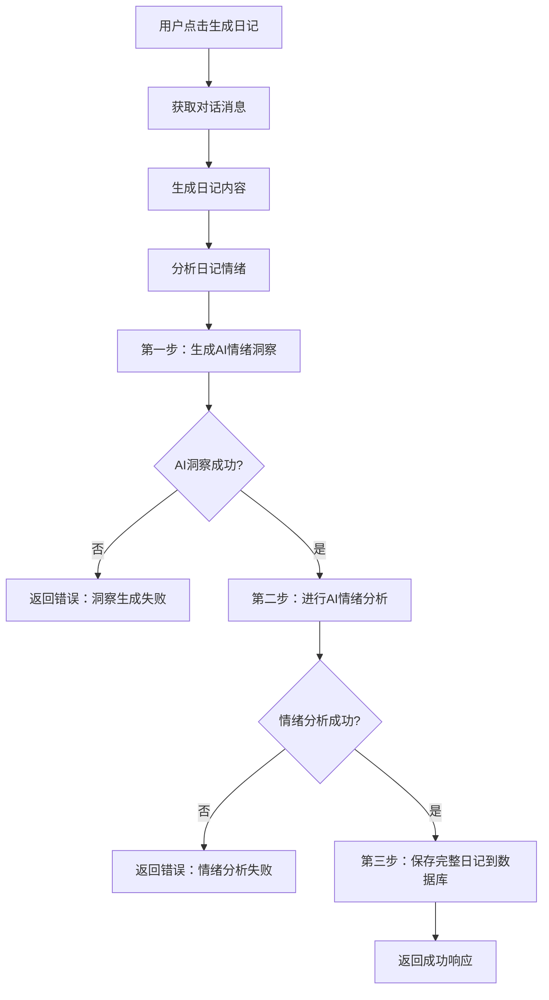
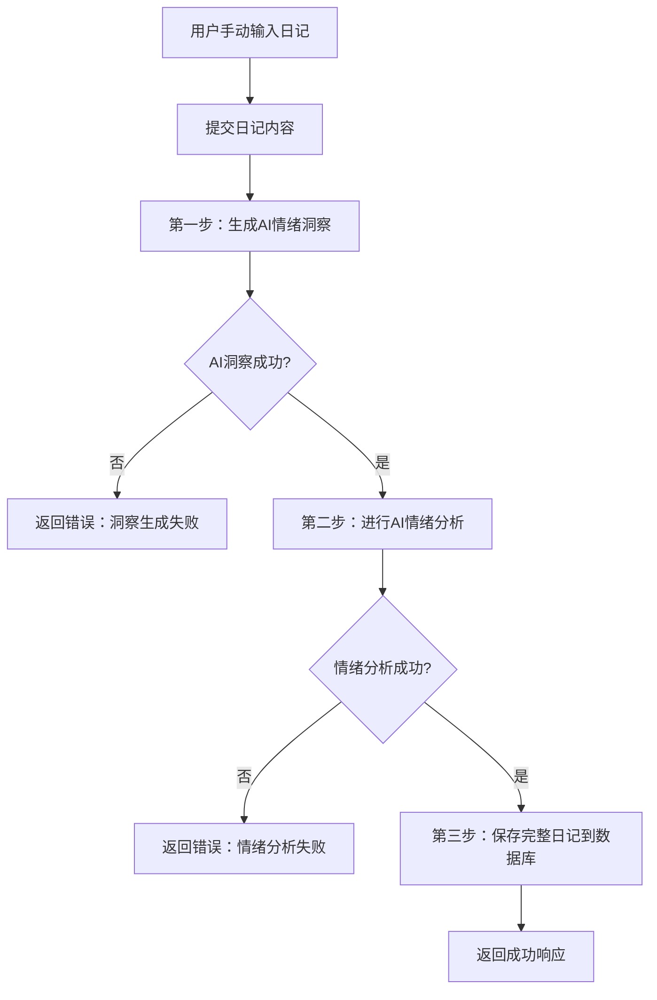
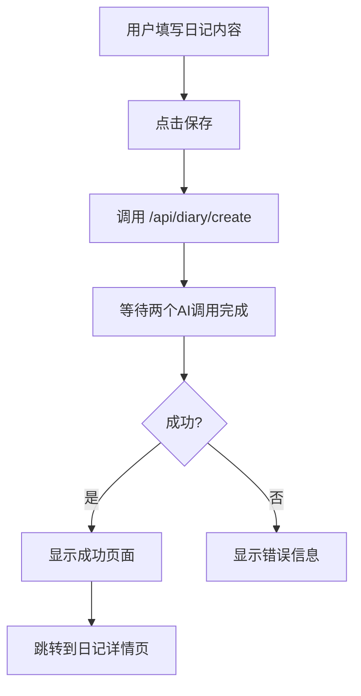
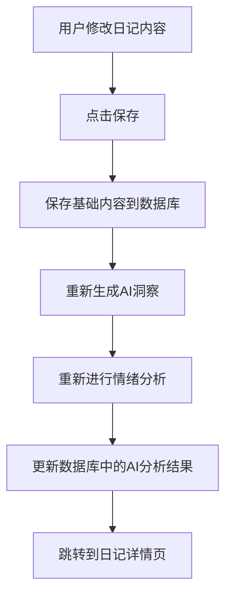

# AI日记生成流程说明（更新版）

## 概述
现在**所有类型的日记创建**都需要经过两个AI调用步骤，只有两个都成功完成，日记才算真正生成成功。

## 修复的问题

### ❌ **之前的问题**
1. **手动创建日记页面** (`/diary/new`)：直接保存到数据库，使用硬编码的AI洞察模板
2. **编辑日记页面** (`/diary/[id]/edit`)：只调用情绪分析，没有AI洞察生成
3. **测试页面** (`/test-ai-insight`)：正确调用了两个AI接口
4. **对话生成日记** (`/api/diary/generate`)：正确调用了两个AI接口

### ✅ **修复后的状态**
现在**所有页面**都确保调用两个AI接口：
1. **AI情绪洞察生成** (`generateAIInsight`)
2. **AI情绪分析** (`analyzeWithDeepSeek`)

## 工作流程

### 1. AI对话日记生成 (`/api/diary/generate`)


### 2. 手动日记创建 (`/api/diary/create`)


### 3. 手动日记创建页面 (`/diary/new`)


### 4. 编辑日记页面 (`/diary/[id]/edit`)


## 关键特性

### ✅ **同步执行**
- 两个AI调用必须**都成功**，日记才算生成完成
- 任何一个失败，整个流程就会终止，返回错误
- 不会出现"部分完成"的状态

### ✅ **数据完整性**
- 日记保存时包含所有AI分析结果
- `ai_insight`：个性化情绪洞察
- `mood_score`：心情指数（1-10）
- `emotion_keywords`：情绪关键词数组
- `event_keywords`：事件关键词数组

### ✅ **错误处理**
- AI洞察失败 → 返回"AI情绪洞察生成失败"
- AI分析失败 → 返回"AI情绪分析失败"
- 数据库保存失败 → 返回"保存日记失败"

### ✅ **用户体验**
- 用户看到的是"完整的日记"或"明确的错误信息"
- 不会出现内容不完整的日记
- 加载状态更准确（等待两个AI调用完成）

## 技术实现

### 代码结构
```typescript
// 第一步：AI情绪洞察
aiInsight = await generateAIInsight({
  title,
  content,
  emotion,
  type: "manual" | "conversation"
})

// 第二步：AI情绪分析  
analysisResult = await analyzeWithDeepSeek(emotionAnalysisPrompt)

// 第三步：保存完整数据
diaryEntry = await supabase.insert({
  ai_insight: aiInsight,
  mood_score: analysisResult.mood_score,
  emotion_keywords: analysisResult.emotion_keywords,
  event_keywords: analysisResult.event_keywords,
  // ... 其他字段
})
```

### 错误处理
```typescript
try {
  // AI调用
} catch (error) {
  return NextResponse.json({ 
    error: "具体错误信息" 
  }, { status: 500 })
}
```

## 测试方法

### 1. 测试页面
访问 `/test-ai-insight` 页面测试手动日记创建

### 2. 手动创建页面
访问 `/diary/new` 页面测试手动日记创建

### 3. 聊天页面
在聊天页面点击"生成今日心语日记"测试对话日记生成

### 4. 编辑页面
编辑现有日记测试AI洞察和情绪分析的重新生成

### 5. 验证结果
- 检查日记是否包含完整的AI洞察
- 检查是否包含情绪分析数据
- 验证错误情况下的响应

## 注意事项

1. **API调用时间**：两个AI调用会增加日记生成时间
2. **错误重试**：用户需要手动重试失败的请求
3. **备用方案**：目前没有备用模板，确保AI服务稳定
4. **监控日志**：通过控制台日志监控每个步骤的执行状态

## 未来优化

1. **并行执行**：两个AI调用可以并行执行减少总时间
2. **重试机制**：自动重试失败的AI调用
3. **备用模板**：AI失败时提供基础模板
4. **进度指示**：前端显示每个步骤的进度

## 修复总结

### 修复的文件
1. `app/diary/new/page.tsx` - 手动创建日记页面
2. `app/diary/[id]/edit/page.tsx` - 编辑日记页面
3. `app/api/diary/create/route.ts` - 手动创建日记API

### 修复的内容
1. **统一API调用**：所有手动创建都调用 `/api/diary/create`
2. **确保AI洞察**：每次创建都会生成个性化AI洞察
3. **完整情绪分析**：包含结构化情绪数据
4. **错误处理**：明确的错误信息和状态

现在你的应用确保了**所有类型的日记**都经过完整的AI分析流程！
